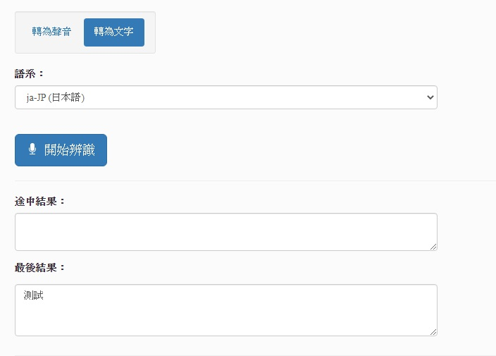

# browser的文字轉語音(Text to Speech)、語音轉文字(Speech to Text)API 實作和調校

## 說明

* 藉由browser所提供的 Speech API進行產生語音朗讀、產生文字等web實務應用。
* Text to Speech Page `須下載必要語言包(browserの各国言語パッケージであるのが必要です)`
  ** 角色為各瀏覽器提供之語音AI模組 **
  
* Speech to Text `須開啟麥克風權限(マイクの許可をあけなければなりません)`

## Demo

Text to Speech：[文字→語音](https://km-chang.github.io/Demo/TextSpeechAI.html?hanashite)

Speech to Text：[語音→文字](https://km-chang.github.io/Demo/TextSpeechAI.html?kaite)

## 其他HTML5應用 | 他にHTML5の応用 | HTML5's other application

canvas：[畫布/電子簽名|絵(電子サイン)](https://km-chang.github.io/Demo/)

camera：[拍照|写真を撮る](https://km-chang.github.io/Demo/)

QRCodeScanner ：[QRCode讀取器|QRコード見分ける](https://km-chang.github.io/Demo/)